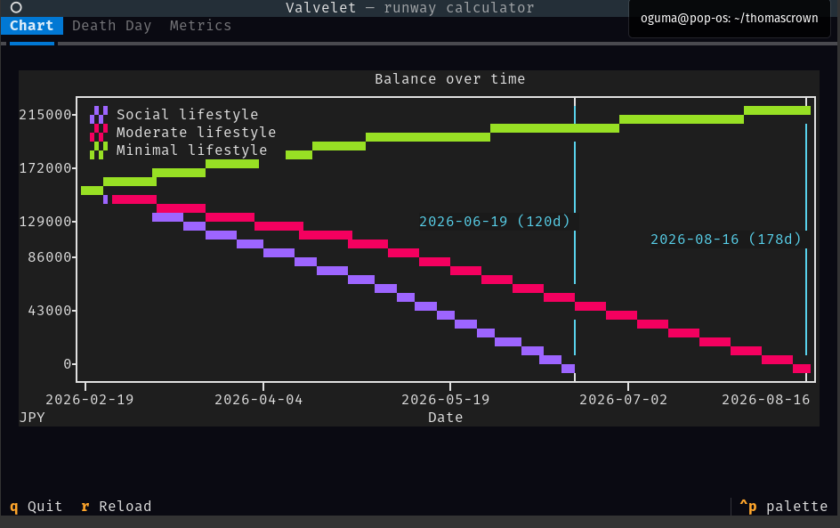
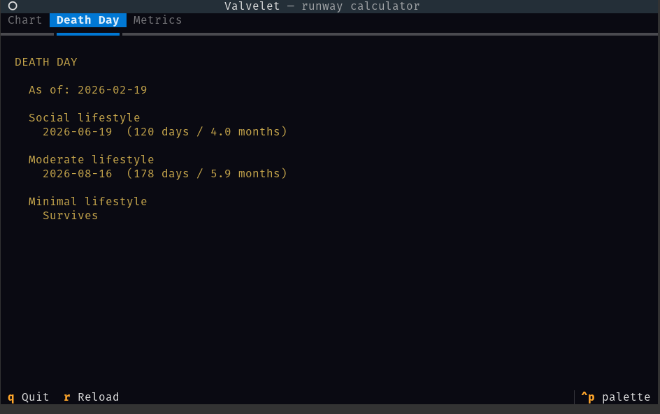

# Valvelet

A terminal runway calculator. It answers one question: **when does the money run out?**

Given your current cash, expected incomes, fixed costs, and lifestyle scenarios, Valvelet simulates your financial future and tells you the **death day** -- the date your balance hits zero.

Compare multiple lifestyle scenarios side by side to see how your choices affect your runway.

## Screenshots

**Chart** -- Balance over time with death day markers



**Death Day** -- When each scenario runs out



**Metrics** -- Burn rates and income breakdown per scenario


## Requirements

- Python 3.10+
- [Textual](https://github.com/Textualize/textual)
- [textual-plotext](https://github.com/Textualize/textual-plotext)

```
pip install textual textual-plotext
```

## Usage

```
python valvelet.py
```

Edit the XML files in `dat/` with your own numbers, then press `r` to reload.

| Key | Action                         |
|-----|--------------------------------|
| r   | Reload XML data and re-simulate |
| q   | Quit                           |

## Data Files

All data lives in `dat/` as hand-editable XML.

### balance.xml

Your current cash and the date it was measured.

```xml
<balance currency="JPY">
  <current as-of="2026-02-19">500000</current>
</balance>
```

### income.xml

Expected future incomes. Each entry has a frequency (`monthly`, `weekly`, `daily`, or `once`) and a date range (`<to>` is optional for ongoing income).

```xml
<income>
  <entry frequency="monthly">
    <source>Freelance client A</source>
    <amount>200000</amount>
    <from>2026-01-01</from>
  </entry>
  <entry frequency="monthly">
    <source>Side project</source>
    <amount>30000</amount>
    <from>2026-01-01</from>
    <to>2026-06-30</to>
  </entry>
</income>
```

### fixed_costs.xml

Monthly fixed costs that apply regardless of lifestyle (rent, utilities, etc.).

```xml
<fixed-costs>
  <cost>
    <name>Rent</name>
    <amount>85000</amount>
  </cost>
  <cost>
    <name>Electricity</name>
    <amount>8000</amount>
  </cost>
</fixed-costs>
```

### scenarios.xml

Lifestyle spending patterns. Each scenario contains activities with a cost per occurrence and a frequency (days per week, 0-7, decimals ok).

```xml
<scenarios>
  <scenario>
    <name>Social lifestyle</name>
    <activity>
      <name>Cafe</name>
      <cost>800</cost>
      <days-per-week>5</days-per-week>
    </activity>
    <activity>
      <name>Restaurant</name>
      <cost>1200</cost>
      <days-per-week>4</days-per-week>
    </activity>
    <activity>
      <name>Shotbar</name>
      <cost>3000</cost>
      <days-per-week>2</days-per-week>
    </activity>
  </scenario>
  <scenario>
    <name>Minimal lifestyle</name>
    <activity>
      <name>Grocery</name>
      <cost>1000</cost>
      <days-per-week>3</days-per-week>
    </activity>
  </scenario>
</scenarios>
```

Expected daily cost per scenario = sum of (cost * days_per_week / 7).

## Tabs

The app has three tabs:

- **Chart** -- Line chart of balance over time for all scenarios. Death days are marked with vertical lines.
- **Death Day** -- When each scenario runs out, sorted by earliest death first.
- **Metrics** -- Daily burn, monthly burn, daily income, net daily, and death day per scenario.

## License

MIT
